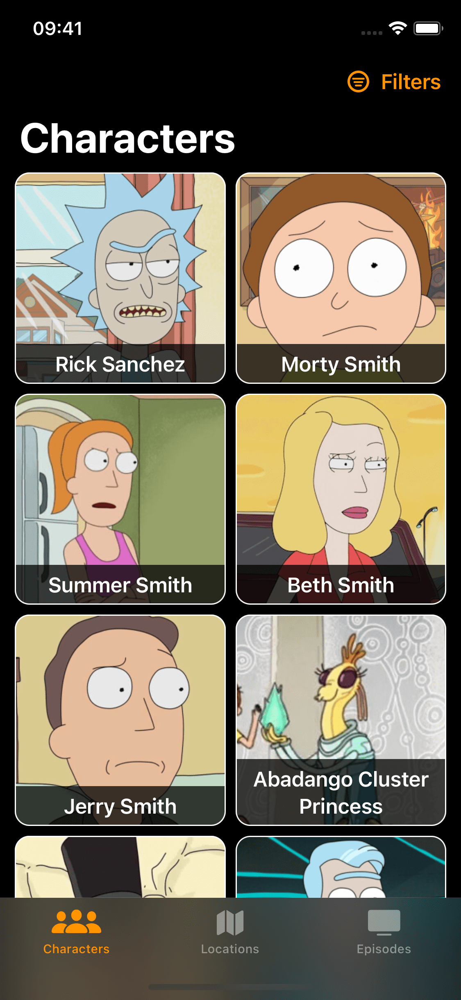
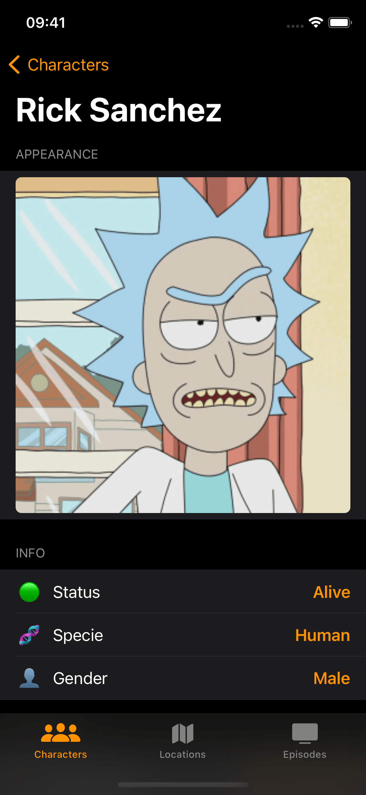
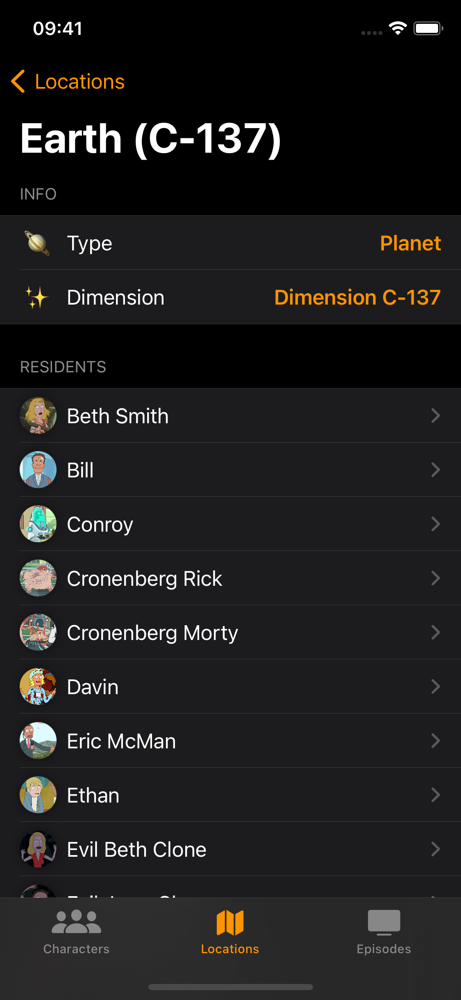
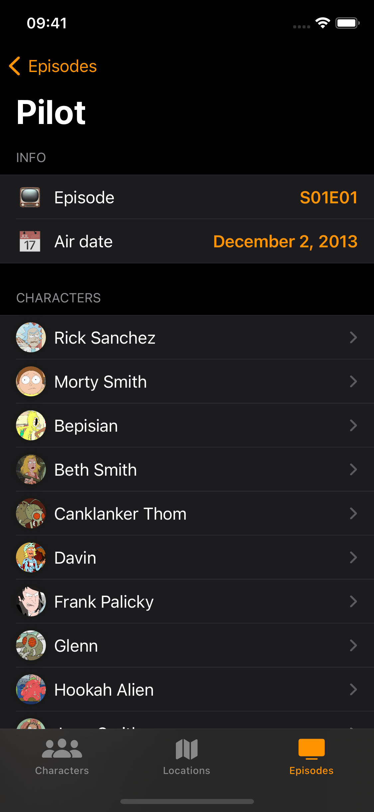

# Rick and Morty Test

A simple app using the [Rick and Morty API](https://rickandmortyapi.com) written in SwiftUI to display the characters, locations and episodes from the [show](https://en.wikipedia.org/wiki/Rick_and_Morty):

Characters list           |  Character detail  |  Location detail  |  Episode detail
:-------------------------:|:-------------------------:|:-------------------------:|:-------------------------:
|||

The app is built using the MVVM architecture with clean architecture, presenting the following key features:
- Usage of async/await
- Decoupled presentation, domain and data layers
- All the features/screens are created inside their corresponding module using SPM (Swift Package Manager)

## Requirements

- iOS 16.0+ (Swift 5.7)
- Xcode 14.1

## Usage
1. Clone the repo
2. Open the workspace file `RickAndMorty.xcodeproj` and run the app
